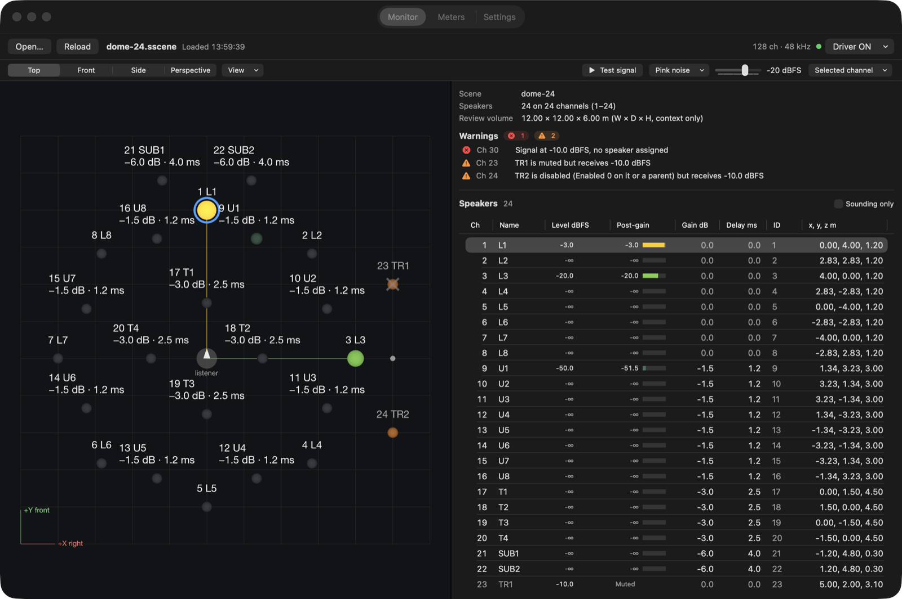
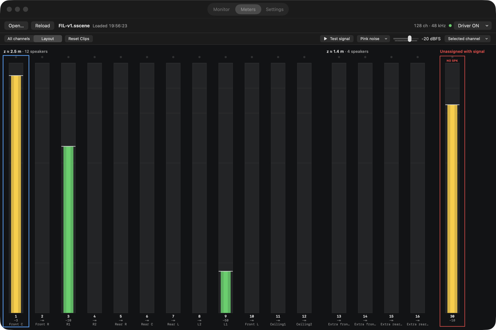
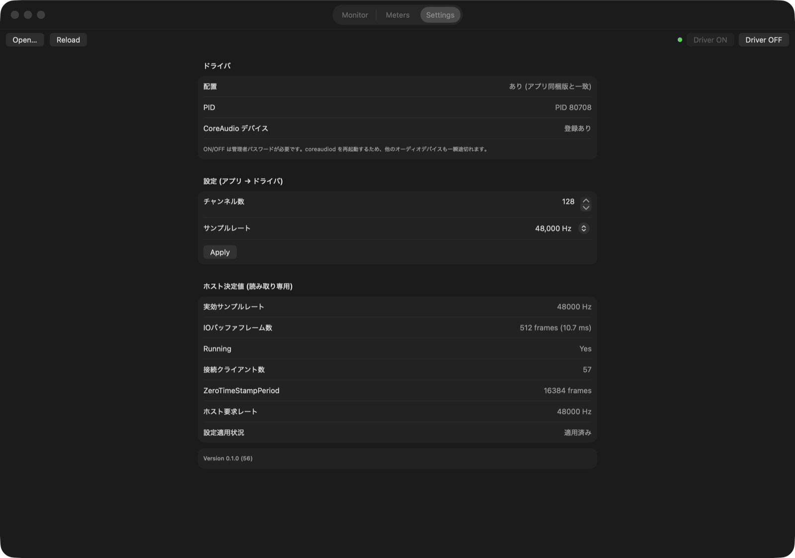
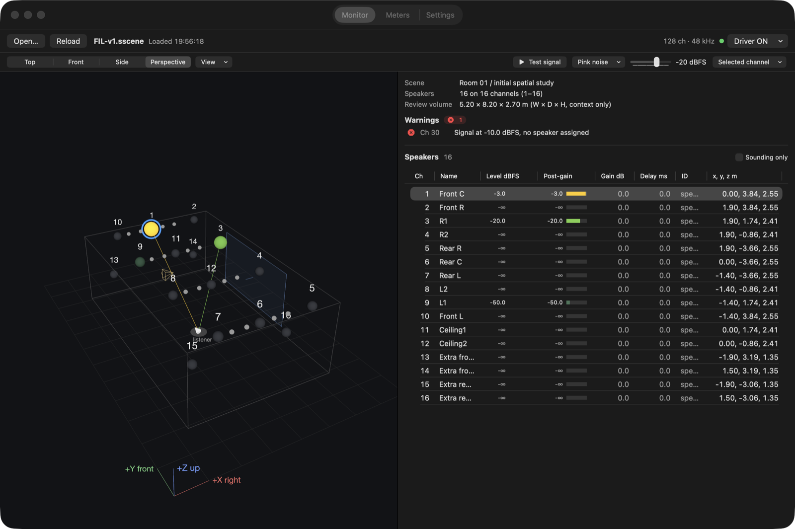

# Virtual Audio Interface

空間オーディオのデバッグ用に作った、macOS 向けの 128ch 仮想オーディオインターフェースと可視化アプリです。
DAW からは普通の出力デバイスとして見え、各チャンネルに何が届いているか、スピーカー配置(`.sscene`)の
どのスピーカーから鳴るはずかを表示します。

[English README](README.md)



## なぜ作ったか

空間オーディオのデバッグは、ふつう実際のスピーカーシステムの前でしかできません。ch17 は本当に天井の
スピーカーか、パンナーが Mute のスピーカーに信号を送っていないか、誰も聴いていないチャンネルにバスが
流れていないか。こうした確認を、現場以外でもできるようにしたくて作りました。

Ableton Live などからは本物のオーディオインターフェースとして認識されるので、信号の流れは現場と同じまま
です。アプリはその結果を、チャンネルごとのメーター、鳴っているスピーカーが光る 3D 配置図、ルーティングの
警告として見せます。

## 機能

- **仮想出力デバイス**: 最大 128ch、44.1 / 48 / 88.2 / 96 kHz。Core Audio の HAL プラグイン
  (AudioServerPlugIn)として実装しています。チャンネル数とサンプルレートはアプリから変更できます。
- **Meters**: 全チャンネルの dBFS メーター(RMS、ピーク、ピークホールド、ラッチ式クリップ表示)。
  読み込んだ配置にスピーカーがないのに信号が来ているチャンネルは「未割当」と表示します。
- **Monitor**: SSD(`.sscene`)のスピーカー配置を、平面図、正面 / 側面の立面、自由視点の 3D で表示します。
  スピーカーはレベルに応じて光り、リスナー位置から発音中のスピーカーへ線を引くこともできます。
  スピーカーをクリックすると、全画面で同じチャンネルが選択されます。
- **ルーティング検証**: 未割当チャンネルへの信号、デバイスのチャンネル数を超えるスピーカー、
  Mute / 無効なスピーカーへの信号、複数スピーカーでのチャンネル共有、パーサー警告。
- **ホストが決める値の表示**: IO バッファサイズ、動作状態、クライアント数、DAW が要求したサンプルレート。
  ホストと実際に何が取り決められたかを確認できます。
- **ドライバの ON / OFF / Update** をアプリから実行できます。OFF のときは、ドライバのプロセスが本当に
  終了したことまで確認します。

| Meters | Settings |
|---|---|
|  |  |



## 動作環境

- macOS 13 以降、Apple silicon / Intel(Universal バイナリ)
- Core Audio デバイスに出力できる DAW などのアプリ

## インストール

1. [Releases](https://github.com/daitomanabe/virtual-audio-interface/releases) から
   `VirtualAudioInterface-<version>.pkg` をダウンロードします。
2. パッケージは公証(notarize)されていないため、最初に開こうとすると macOS にブロックされます。
   一度開いてから **システム設定 → プライバシーとセキュリティ** で、パッケージについての表示の横にある
   **このまま開く** をクリックしてください。ターミナルで隔離属性を外す方法もあります。
   ```bash
   xattr -d com.apple.quarantine ~/Downloads/VirtualAudioInterface-0.1.0.pkg
   ```
3. インストーラーを実行します。次の 2 つが入ります。
   - `/Applications/VirtualAudioInterface.app`
   - `/Library/Audio/Plug-Ins/HAL/VirtualAudioInterfaceDriver.driver`

   ドライバを読み込むために `coreaudiod` を再起動するので、**その間は Mac のすべてのオーディオデバイスが
   1〜2 秒途切れます**。

### アンインストール

アプリを終了してから [`packaging/uninstall.sh`](packaging/uninstall.sh)(各リリースにも添付)を実行します。

```bash
sudo ./uninstall.sh
```

アプリとドライバを削除し、パッケージの記録を消して `coreaudiod` を再起動します。
アプリは残してドライバだけを外すときは、アプリの **Driver OFF** を使ってください。

## 使い方

1. **Virtual Audio Interface** を開きます。右上の点が緑ならドライバが読み込まれています。
2. DAW の出力デバイスに **Virtual Audio Interface (128ch)** を選びます。
   Ableton Live では *設定 → オーディオ → オーディオ出力デバイス* で選び、*出力設定* で使うチャンネルを
   有効にします。
3. **Open…**(⌘O)で配置ファイルを開くか、`.sscene` をウィンドウにドロップします。
   まずは [`Examples/dome-24.sscene`](Examples/dome-24.sscene) を試してください。
4. 再生すると、**Monitor** タブで信号が来ているスピーカーが光り、**Meters** で全チャンネルが見えます。

次回起動時は最後に開いた配置を自動で開きます。ファイルを編集したら **Reload**(⌘R)で読み直せます。

## スピーカー配置(SSD / .sscene)

配置は SSD(Spatial Scene Definition)v0.1 というタブ区切りテキスト形式で書きます。アプリが読むのは下の
セクションで、それ以外の SSD のセクション(スクリーン、プロジェクター、カメラなど)は受け付けて無視します。

```text
[SCENE]
Version	0.1
Name	ring-8
Unit	meter
CoordinateSystem	SSD_RH_ZUP
AngleUnit	degree

[OBJECT]
# ID	Type	Name	Parent	X	Y	Z	Yaw	Pitch	Roll	Enabled
1	speaker	SP1	none	0.000	3.000	1.2	0	0	0	1
2	speaker	SP2	none	2.121	2.121	1.2	0	0	0	1

[SPEAKER]
# ID	Channel	Gain	Delay	Mute
1	1	0	0	0
2	2	0	0	0
```

- 右手系で、**+X が右、+Y が前、+Z が上**。単位はメートルと度です。
- `Parent` には別の OBJECT(または `none`)を指定します。ワールド変換は
  親 × T(X,Y,Z) × Ry(Roll) · Rx(Pitch) · Rz(Yaw) です。自分か祖先のどれかが `Enabled` 0 なら無効になります。
- `[SPEAKER]` は type が `speaker` の OBJECT を 1 始まりの出力チャンネルに割り当てます。`Gain` は dB、
  `Delay` はミリ秒、`Mute` は 0/1。1 つのチャンネルを複数のスピーカーで共有してもかまいません。
- `[REVIEW_VOLUME]`(Width, Depth, Height)は情報として表示するだけです。
- SSD にはスピーカーの正面方向の定義がないため、スピーカーの向きは描いていません。

パーサー([`ssd_reader.h`](VisualizerApp/Sources/SSDBridge/ssd_reader.h))は、ヘッダー、数値、親の参照、
循環参照を検証し、エラーは行番号付きで表示します。

### ルーティング警告

| 警告 | 条件 |
|---|---|
| 未割当(赤) | -60 dBFS を超える信号があるのに、そのチャンネルのスピーカーがない |
| 範囲外(赤) | スピーカーのチャンネルが、デバイスの有効チャンネル数を超えている |
| Mute / 無効(橙) | Mute または無効なスピーカーのチャンネルに信号がある |
| パーサー(橙) | 未知のセクションなどのパーサー警告 |
| チャンネル共有(青) | 同じチャンネルを複数のスピーカーが使っている(情報) |

## 設定とホストが決める値

| アプリから設定 | 範囲 |
|---|---|
| チャンネル数 | 1〜128 |
| サンプルレート | 44100 / 48000 / 88200 / 96000 Hz |

**IO バッファサイズはドライバではなくホスト(DAW)が決める**ため、表示だけで設定はできません。
Settings タブでは、実際に有効なサンプルレート、動作状態、クライアント数、ホストが最後に要求したレート、
設定変更が適用済みかどうかも確認できます。

## 仕組み

```text
 DAW ──Core Audio (最大 128ch)──▶ HAL プラグイン ──POSIX 共有メモリ──▶ アプリ
                                  (coreaudiod の                         ├─ Meters
                                   ドライバ用プロセスで動く)             ├─ Monitor ◀── .sscene
                                                                        └─ Settings ──設定──▶ プラグイン
```

- プラグイン([`VirtualAudioDevicePlugin.cpp`](HALPlugin/src/VirtualAudioDevicePlugin.cpp))は、出力デバイス
  1 つを持つ AudioServerPlugIn を一から実装したものです。IO サイクルごとにチャンネル別のピーク、RMS、
  クリップ回数を計算します。ピークには減衰処理をかけ、アプリの 60 Hz ポーリングでも短いピークを
  取りこぼさないようにしています。
- レベルとデバイス状態は、固定サイズの共有メモリ([`MeterShm.h`](Shared/MeterShm.h))でやり取りします。
  アプリはチャンネル数とサンプルレートの変更要求を同じ領域に書き、プラグインは標準の
  `RequestDeviceConfigurationChange` の手順で適用します。
- ドライバの ON では `/Library/Audio/Plug-Ins/HAL` にコピーして `coreaudiod` を再起動します。OFF では削除して
  再起動し、`Core Audio Driver (VirtualAudioInterfaceDriver.driver)` プロセスとデバイスが消えたことを
  確認します(残ったプロセスは PID を指定して強制終了します)。

## ソースからビルド

Command Line Tools だけでビルドできます(Xcode は不要です)。

```bash
./build_app.sh                 # ドライバ + dist/VirtualAudioInterface.app(Universal)
open dist/VirtualAudioInterface.app --args "$PWD/Examples/dome-24.sscene"
packaging/build_pkg.sh         # dist/VirtualAudioInterface-<VERSION>.pkg と .sha256
```

`HALPlugin/install.sh` は、ビルドしたドライバを直接インストールする開発用のスクリプトです。
バージョンは [`VERSION`](VERSION)、ビルド番号はコミット数から付けます。

### テストとツール

```bash
make -C Tools check            # 共有メモリとメーターの減衰計算、SSD パーサーと座標変換
make -C Tools harness          # coreaudiod と同じ呼び出しでプラグインを ASan/UBSan 検査
```

- `dist/VirtualAudioInterface.app/Contents/MacOS/VisualizerApp --status` でドライバの状態を表示します。
- `... --docshot <dir> [scene.sscene]` で全タブを PNG に書き出します(上のスクリーンショットもこれで撮影)。
- `Tools/fake_meter [sweep|sine|clip]` は DAW なしで合成レベルを書き込みます。ドライバと同じ共有メモリを
  使うので、ドライバが OFF のときだけ使ってください。

## ディレクトリ構成

```text
HALPlugin/        Core Audio HAL プラグイン(C++)、Makefile、開発用インストールスクリプト
Shared/           プラグインとアプリが共有するメモリレイアウト
VisualizerApp/    Swift パッケージ: SwiftUI アプリ、AudioBridge(共有メモリ)、SSDBridge(SSD パーサー)
Tools/            セルフチェック、HAL 検査ツール、fake meter
Examples/         サンプルの .sscene
packaging/        インストーラー(pkg)のビルド、アンインストールスクリプト
```

## TODO

詳細は [TODO.md](TODO.md)(英語)にあります。主な項目は次のとおりです。

- **UI の洗練**: デザインの統一(文字、余白、色、ライト / ダーク)、アプリアイコン、メーターのレイアウト切替と
  スピーカー層ごとのグループ表示、近いスピーカーのラベルの重なり解消、Gain / Delay の可視化、
  メニューバー常駐、初回起動ガイド、UI の日英対応
- **テスト機能**: チャンネル / スピーカーごとのテスト信号、実オーディオインターフェースへのパススルー、
  rE / rV ベクトル表示、メーターの記録と再生、OSC 出力
- **ドライバ**: チャンネル数に合わせたデバイス名、HAL コントロールとしてのミュート / トリム、
  ループバック入力、共有メモリの設定領域の保護、パスワード入力なしの ON/OFF(特権ヘルパー)
- **配布**: Developer ID 署名と公証、GitHub Actions、Homebrew cask

## ライセンス

[MIT](LICENSE) © 2026 Daito Manabe
